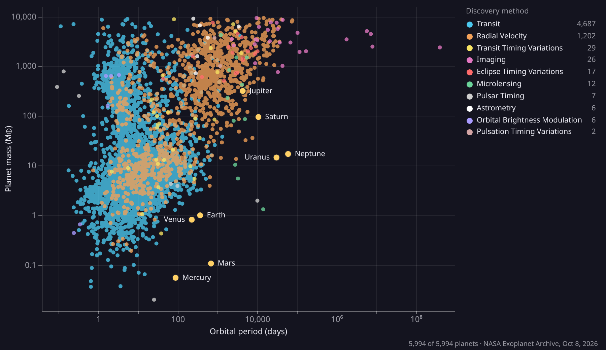

# Exoplanet plot for Parallax

A [Parallax](https://parallax-presentations.com) plugin that plots the planets in the [NASA Exoplanet Archive](https://exoplanetarchive.ipac.caltech.edu/) on any two of nine quantities.



- Orbital period, semi-major axis, planet mass, planet radius, insolation, equilibrium temperature, star temperature, distance or discovery year, on a log or linear scale
- Colored by discovery method or by discovery year; click a method in the legend to hide it
- The Solar System's planets for scale
- A card for each planet when you hover over it
- A year slider that plays the discoveries, one year at a time
- Planets picked out by name, such as TRAPPIST-1

## Add it to a deck

In the Parallax editor, open **Plugins › Browse plugins…**, find **Exoplanet plot**, and install it. Its element is then in the **Plugins** menu. To change a plot, select it, hover over it, and use the settings button at its top right.

Until it's listed, it can be published from this repo: **Plugins › Browse plugins… › Publish**, paste `https://github.com/jbirky/parallax-exoplanets`, and pick a version tag. An admin reviews each version before others can install it.

## Where the data comes from

The plugin carries a snapshot of the archive's Planetary Systems Composite Parameters table (`pscomppars`, one row per planet), dated in the plot's corner. It needs no network access, so it works offline and in exported decks.

To keep a plot current, plot a live dataset instead:

1. In the editor, open **Data**, then **Add › From a TAP query**, with the NASA Exoplanet Archive and this query:

   ```sql
   select pl_name, discoverymethod, disc_year, pl_orbper, pl_orbsmax, pl_bmasse,
          pl_rade, pl_insol, pl_eqt, st_teff, sy_dist
   from pscomppars
   ```

2. Link the dataset to the deck, and choose how often Parallax fetches it.
3. In the plot's settings, choose the dataset under **Data**.

The plugin reads the archive's column names, so a dataset can leave out the quantities you won't plot. The plot can't ask the archive itself, because the archive's TAP service doesn't answer requests from other sites' pages. Parallax fetches it on the server instead.

## Settings

The settings button writes these into the element's data, which is where Parallax keeps them.

| Setting | Key | Values |
| --- | --- | --- |
| Horizontal and vertical axes | `x`, `y` | `period`, `semimajor`, `mass`, `radius`, `insolation`, `teq`, `steff`, `distance`, `year` |
| Log scale | `xLog`, `yLog` | `true` or `false`; unset, each quantity's usual scale |
| Color by | `color` | `method`, `year` or `none` |
| Hidden methods | `hiddenMethods` | Discovery methods, as the archive names them |
| The Solar System | `solarSystem` | `true` or `false` |
| Highlight | `highlight` | Part of a planet's name |
| Year slider | `timeline`, `throughYear` | Whether it shows, and the last year plotted (unset, every year) |
| Text | `theme` | `dark` (light text, for dark slides) or `light` |
| Title and point size | `title`, `pointSize` | Text, and 1 to 8 |
| Data | `dataset` | A deck dataset's name, or empty for the snapshot |

## Develop

```sh
npm run snapshot   # fetch the archive into data/snapshot.json
npm run build      # write dist/sandbox.html and dist/icon.svg
npm test
```

There are no dependencies; it needs Node 18 or later. Open `dist/sandbox.html` in a browser to try the plot outside Parallax.

- `src/plot.js`: the arithmetic (quantities, scales, ticks, formats, the snapshot's encoding), tested in `test/`
- `src/app.js`: drawing, the legend, hover cards, settings and the year slider
- `src/styles.css` and `src/sandbox.html`: the page

Parallax puts a plugin's page in an iframe's `srcdoc`, where links to other files lead nowhere, so the build writes everything into one file, with the snapshot gzipped. Parallax imports the built files at a tag, so `dist/` is committed.

The page talks to Parallax through `window.parallax`: `data` and `onDataChanged` for its settings, `updateData` to change them, and `datasets` for a deck's datasets. Community plugins run in a sandbox with no network access beyond the hosts their manifest lists, and this one lists none.

## Release

1. Set the new version in both `parallax-plugin.json` and `package.json`.
2. Run `npm run build` and `npm test`, then commit.
3. Tag the commit `vX.Y.Z` and push the tag.
4. In Parallax, publish that tag. Decks keep drawing the version they were made with until someone updates them.

## Credit

This plugin uses data from the NASA Exoplanet Archive, which is operated by the California Institute of Technology, under contract with the National Aeronautics and Space Administration under the Exoplanet Exploration Program.

## License

[MIT](LICENSE)
